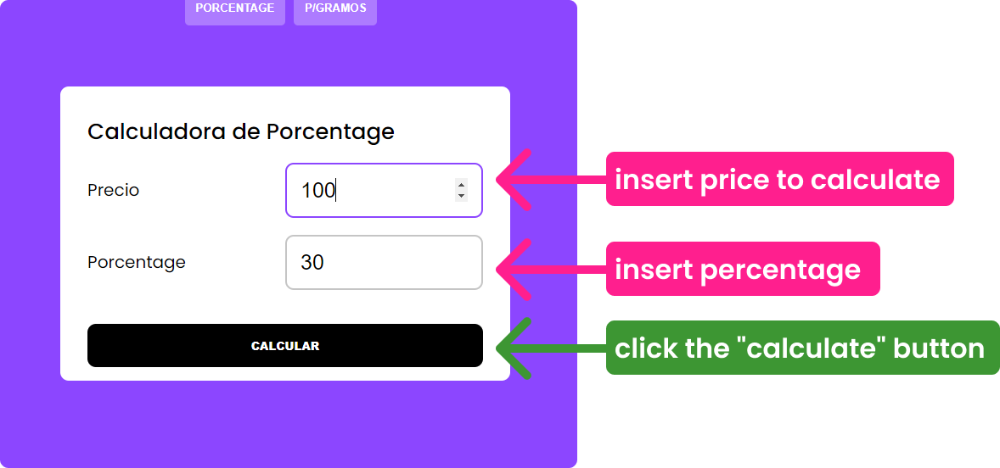
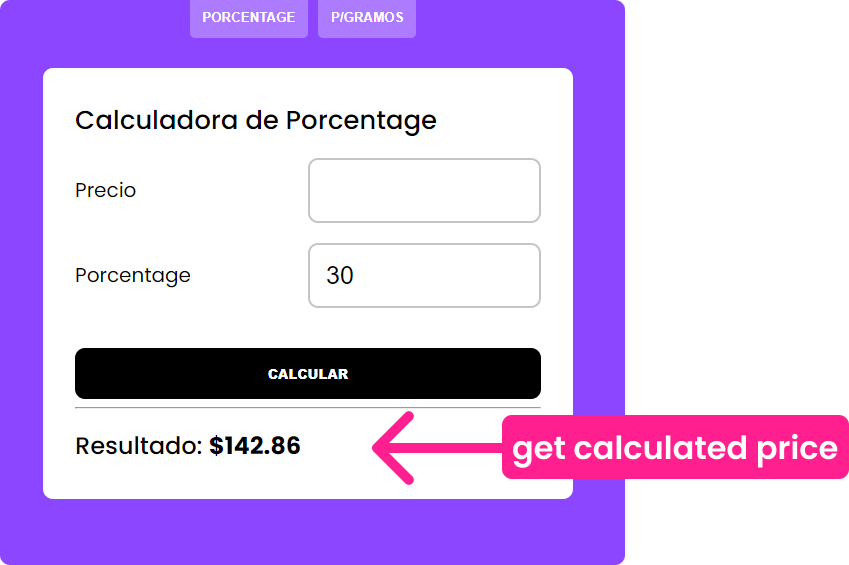

# 🤩 Percentaje Calculator ✅

### The application that no one asked for, but that will help you calculate the sale price. [Demo link](https://percentage-calculator-drab.vercel.app/)

### **Use of the aplication (tutorial)**

- This app was created to help my mom get sale prices. 🤗
- The idea was to make it as simple as possible and easy to understand.
- It has words written in Spanish to make it much easier for you.

### ⚠️ Super complicated mathematical formula used in the app **(sarcasm)** 😂😂
- To calculate the percentage you need to apply the following 👉 **price * percentage = (result / 100) * price**

💖 code made with love and javascript